# CMSC 23 Final Project

### Carl Joven M. Marasigan

### 2019-03365

### WX-4L

# Instructions

- Setup the environment (see here: https://codelabs.developers.google.com/codelabs/flutter-codelab-first?authuser=0#1)
- In the terminal, cd to 'project-social-media-application-cj-mm/social_media_app' directory
- Run 'flutter pub get' to install dependencies
- Run 'flutter run' to start the social media app

# Documentation

### - Challenges met while doing the project

> The greatest challenge I had was to sit down and just start to do the project. I literally had more than a year to finish this project. However, I still did it in the last minute due to various personal reasons and responsibilities. I was definitely at fault though. Before doing the project, I need to essentially relearn all the lessons as I almost completely forgot most of them. Fortunately, the learning was easier than expected. I think I recalled the lessons fast enough to be able to code in flutter again. For the actual project, I especially had a hard time understanding and coding the models used in http requests. At first, it was difficult for me to grasp the conversion of datatypes when data are passed from the network to the app and vice versa. I also encountered other common errors in flutter such as pixel overflow. Lastly, despite being easier than CSS (for me at least), I still struggled a bit handling the layouts for the gui.

### - Happy/Unhappy paths encountered

### Login

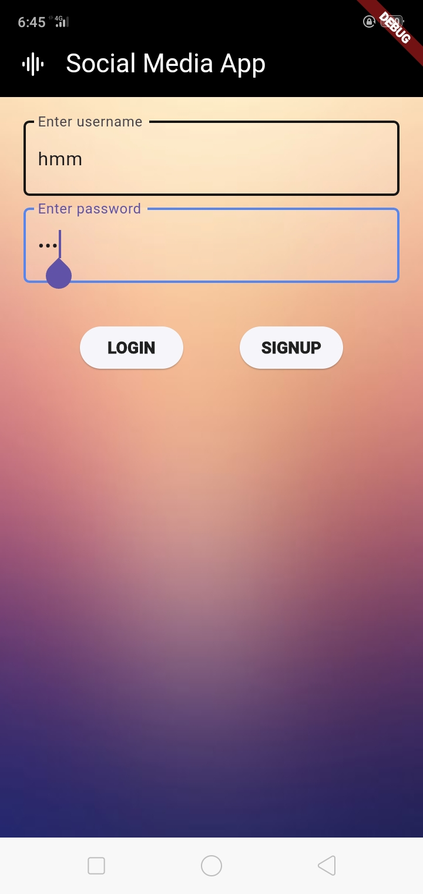 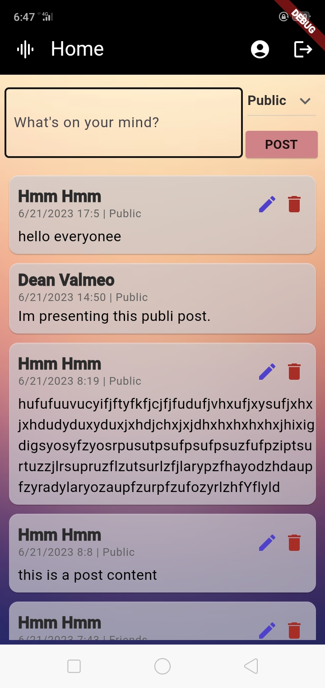

#### To reproduce:

- Enter a valid username and password then click login.

#### Result

- App works and does not produce any errors. Logs in and Redirects to homepage.

<!--  -->

### Signup

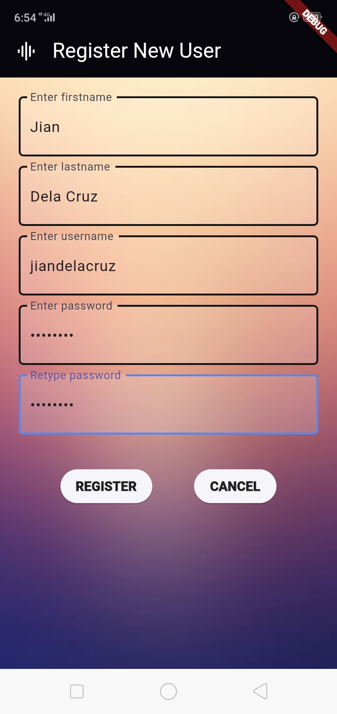 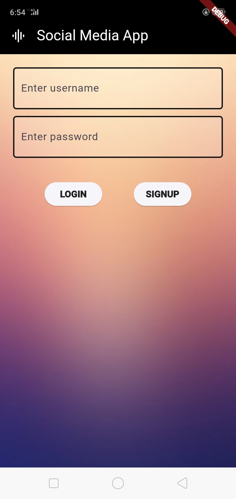

#### To reproduce:

- Fill all the textfield with valid inputs then click register.

#### Result

- App works and does not produce any errors. Creates a new user and redirects to login page.

<!--  -->

### Create Post

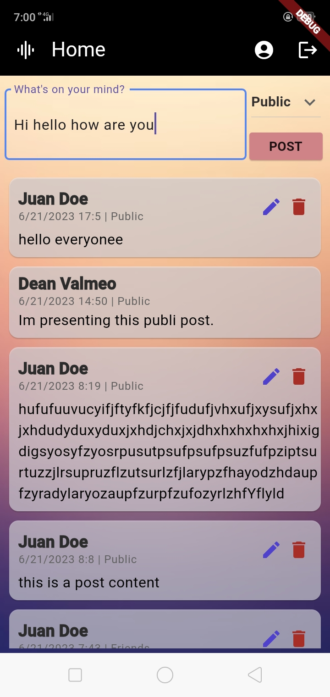 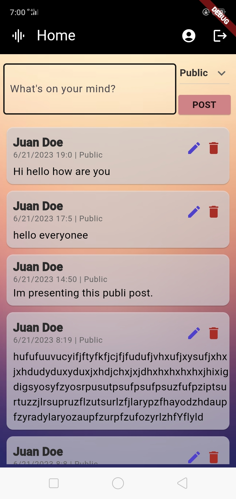

#### To reproduce:

- Write something in the Home textfield, choose from the dropdown, then click Post.

#### Result

- App works and does not produce any errors. Creates a new post and displays it in the gui.

<!--  -->

### Edit a Post

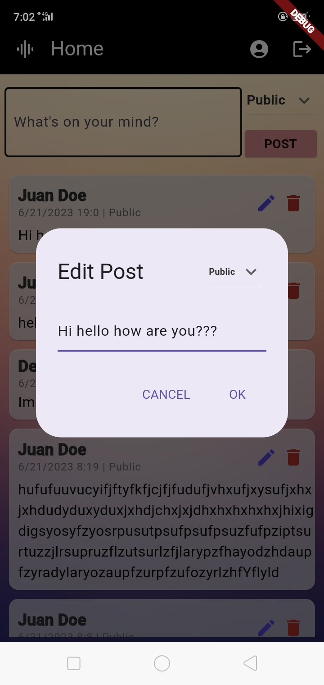 

#### To reproduce:

- Click the edit icon from one of your posts, modify your post, then click OK.

#### Result

- App works and does not produce any errors. A modal with textfield appears. Updates the selected post and displays it in the gui.

<!--  -->

### Delete a Post

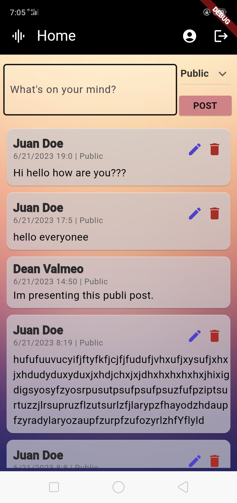 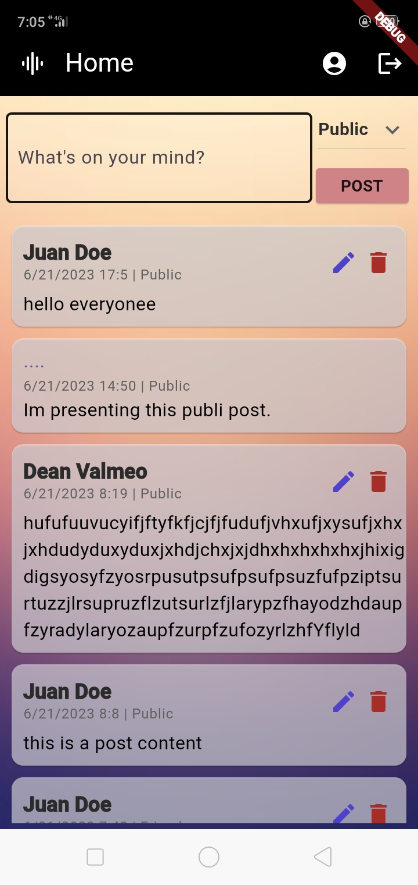

#### To reproduce:

- Click the delete icon from one of your posts.

#### Result

- App works and does not produce any errors. Deletes the selected post and removes it in the gui.

<!--  -->

### Go to your profile

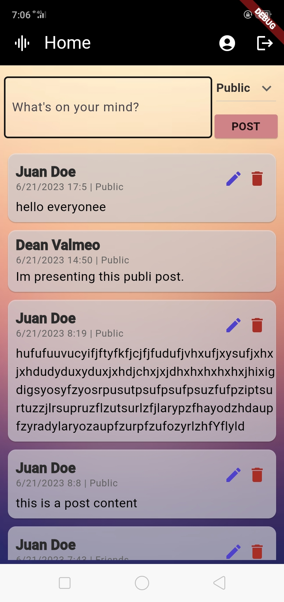 

#### To reproduce:

- Click the profile icon in the appbar.

#### Result

- App works and does not produce any errors. Redirects to your profile and displays user details.

<!--  -->

### Go to other user's profile

 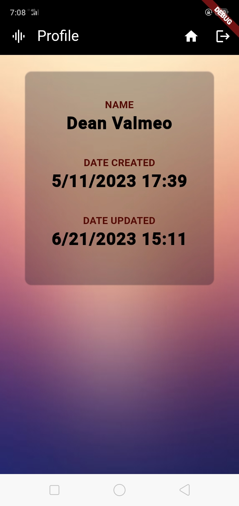

#### To reproduce:

- Click other name of one of the users in your feed.

#### Result

- App works and does not produce any errors. Redirects to the selected profile and there, edit profile is not displayed.

<!--  -->

### Edit name

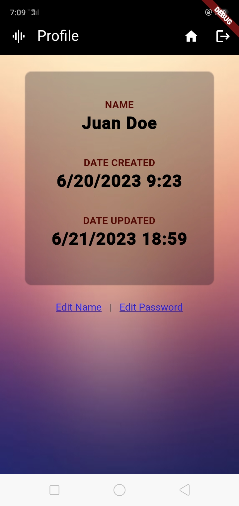 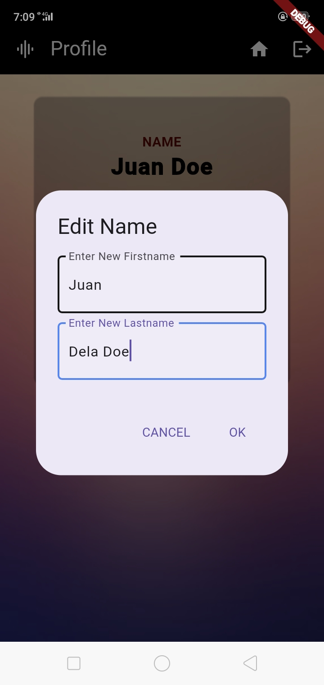 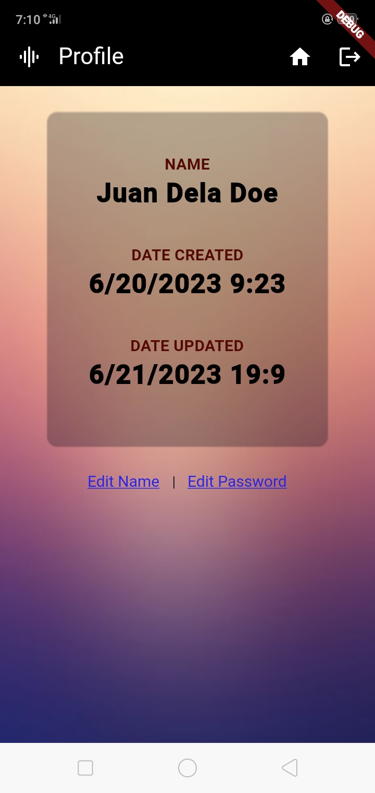

#### To reproduce:

- Click Edit Name in your profile. Enter new first and lastname then click ok.

#### Result

- App works and does not produce any errors. A modal with textfields appears. Updates the user name and displays the new name in the gui.

<!--  -->

### Edit password

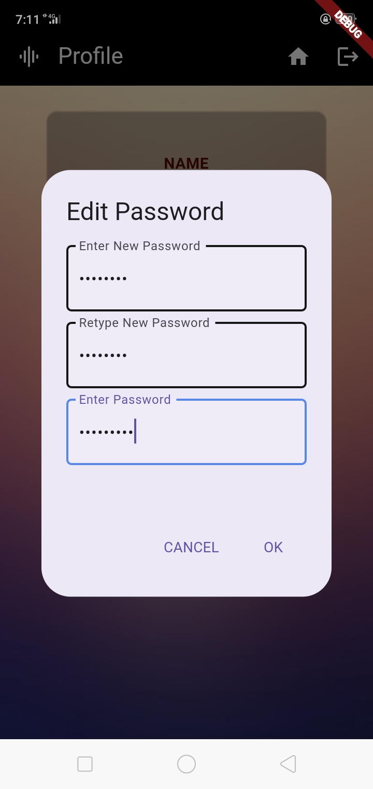 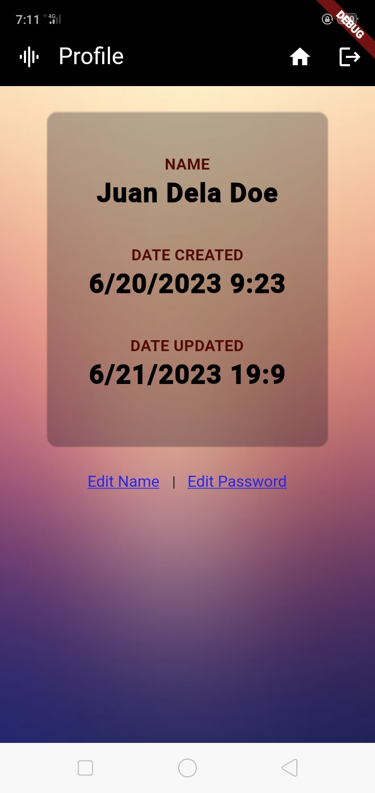

#### To reproduce:

- Click Edit Password in your profile. Enter new and old password then click ok.

#### Result

- App works and does not produce any errors. A modal with textfields appears. Updates the user password.

<!--  -->

### Logout

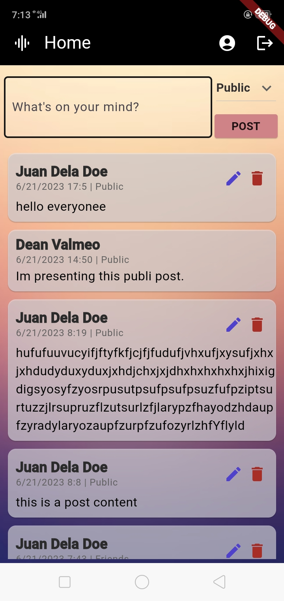 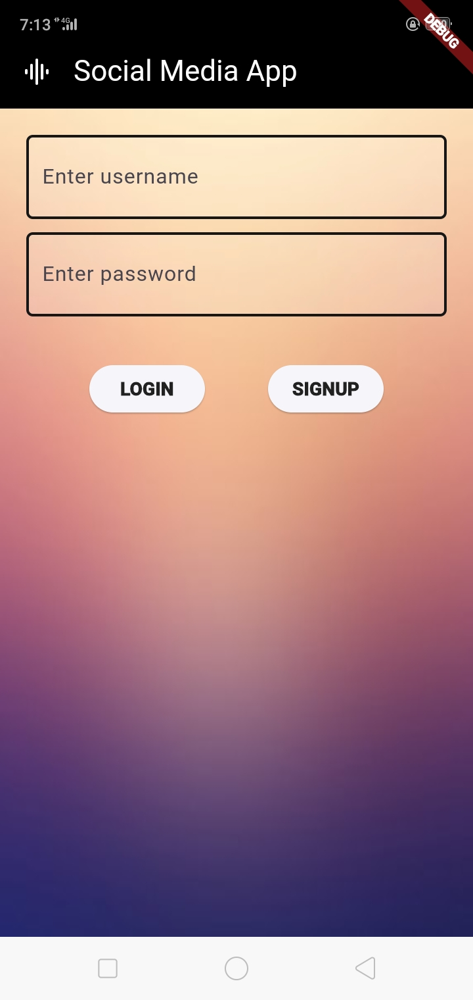

#### To reproduce:

- Click the logout icon in the appbar.

#### Result

- App works and does not produce any errors. Logs out and redirects to the login page.
